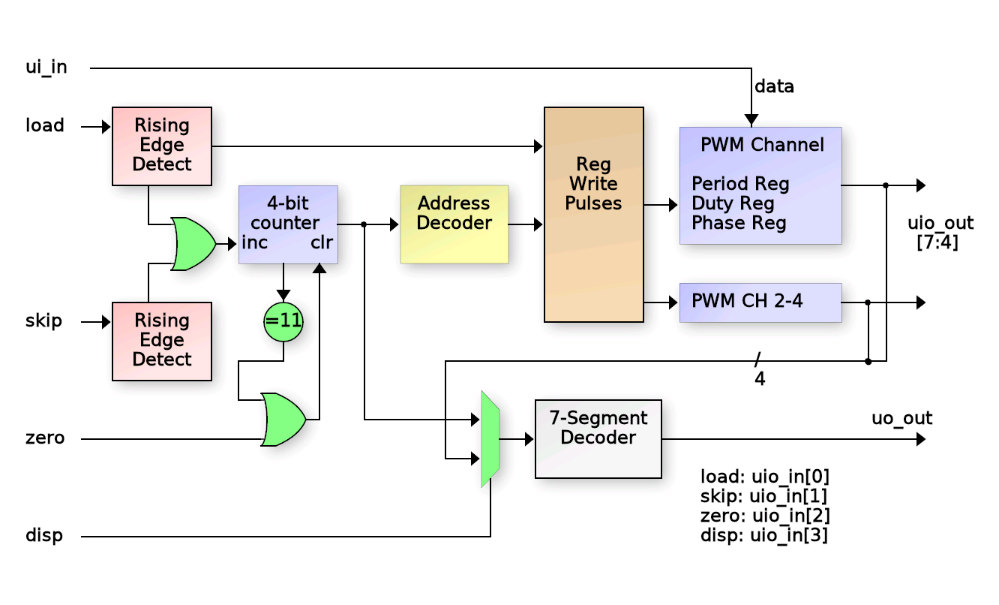
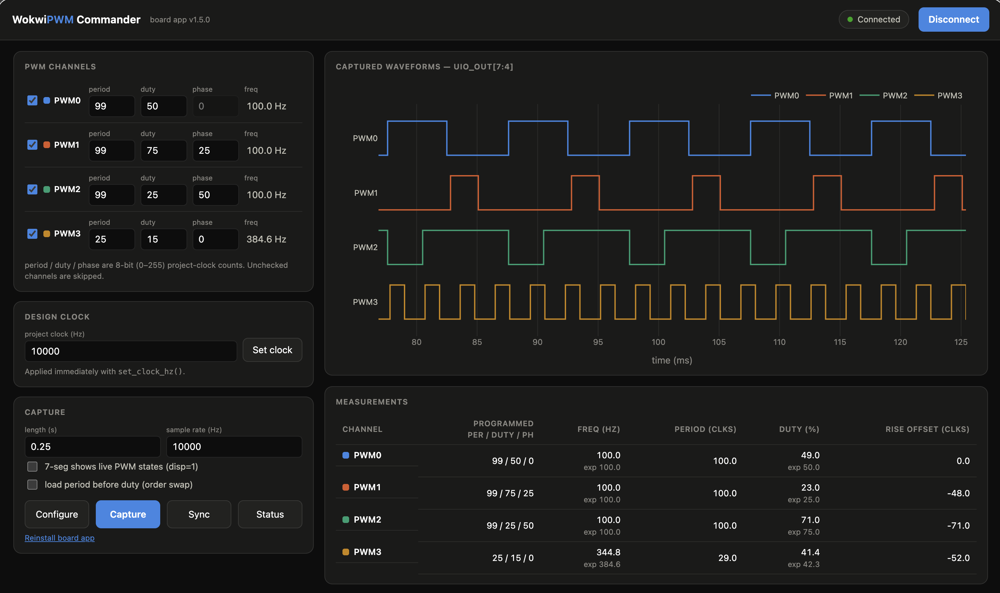

# WokwiPWM — 4-channel programmable PWM generator

A four-channel programmable PWM peripheral, designed entirely in the
[Wokwi](https://wokwi.com/projects/445338187869298689) logic editor and
fabricated on the **Tiny Tapeout sky25b** shuttle
(macro `tt_um_wokwi_445338187869298689`, mux address 748, 10 kHz default
project clock).

**And yes — it works on real silicon.** See the
[bring-up story](#bringing-it-up-on-silicon) below.



## Features

- 4 independent PWM channels, each with an 8-bit **period** and **duty**
  register
- 8-bit **phase** registers on PWM1–PWM3 that delay each channel's first
  count-start relative to PWM0 — programmable phase-shifted outputs
- Simple 3-wire register-load interface (`load` / `skip` / `zero`) with the
  data byte on `ui_in[7:0]`
- A control register to re-zero individual channel counters for
  re-synchronization after programming
- 7-segment display output showing either the register-load address or the
  live PWM output states (selected by `disp`)

Each channel's counter counts 0…period. The output goes **high** when the
counter reaches `duty` and **low** when it rolls over, so:

    f_out     = f_clk / (period + 1)
    high time = period − duty + 1 clocks

## Pinout

| Pin | Function |
|---|---|
| `ui_in[7:0]` | Register data byte |
| `uio_in[0]` | `load` — rising edge: load register at current address, address += 1 |
| `uio_in[1]` | `skip` — rising edge: address += 1 without loading |
| `uio_in[2]` | `zero` — rising edge: address = 0, re-arms the phase delays |
| `uio_in[3]` | `disp` — 7-seg source: 0 = load address, 1 = live PWM states |
| `uio_out[7:4]` | PWM0…PWM3 outputs |
| `uo_out[6:0]` | 7-segment display (via 4-bit hex decoder) |

## Register map

Registers load in address order; `zero` resets the address, `load` writes
and advances, `skip` advances without writing (leaving a register at its
previous value):

| Addr | Register | Addr | Register |
|---|---|---|---|
| 0x0 | PWM0 duty   | 0x6 | PWM3 duty   |
| 0x1 | PWM0 period | 0x7 | PWM3 period |
| 0x2 | PWM1 duty   | 0x8 | PWM1 phase  |
| 0x3 | PWM1 period | 0x9 | PWM2 phase  |
| 0x4 | PWM2 duty   | 0xA | PWM3 phase  |
| 0x5 | PWM2 period | 0xB | Control     |

Control register bit *i* re-zeroes PWM *i*'s counter, allowing the channels
to be re-synchronized after reprogramming. (PWM0 has no phase register —
the other channels' phases are relative to it.)

One gotcha worth knowing: the `load`/`skip`/`zero` edge detectors are
sampled by the **project clock**, so registers should be programmed with
the design clocked at ≥10 kHz. If you want to *run* it slower (fun for
watching LEDs), program first, then slow the clock down — the test apps
below do this automatically.

## Bringing it up on silicon

The chips came back from the sky25b shuttle, and this design got a full
hardware-in-the-loop test rig on the Tiny Tapeout demoboard (RP2350B).
Everything lives in [`pwm-test/`](pwm-test/) in this repo.

### The measurement problem

Programming the registers is easy — bit-bang `load`/`skip`/`zero` from
MicroPython. *Verifying* the outputs is the interesting part: four PWM
channels with programmable phase relationships need to be sampled
simultaneously, and Python-loop polling isn't going to cut it.

The trick: on the demoboard, the four PWM outputs (`uio_out[7:4]`) land on
four **consecutive** RP2350 GPIOs (29–32). That's a perfect setup for a
one-instruction PIO program — `in pins, 4` — acting as a 4-channel logic
analyzer, sampling at exactly the configured rate, packing 8 samples per
word, and DMA-ing straight to RAM. Two wrinkles worth noting if you borrow
this: GPIO32 sits outside the PIO's default pin window on the RP2350B
(fixed with `PIO.gpio_base(16)`), and the capture deliberately starts
*before* the `zero` toggle so the phase-delayed first edges are inside the
record.

### PWM Commander

On top of that sits **PWM Commander**
([`pwm-test/web/index.html`](pwm-test/web/index.html)) — a single-file web
app that talks MicroPython's raw-REPL protocol directly over Web Serial
(Chrome/Edge). Connect the demoboard over USB and it:

1. auto-installs (and auto-updates) the MicroPython test package onto the
   board,
2. enables the WokwiPWM project on the shuttle mux,
3. programs period/duty/phase for each channel — at a programming-safe
   clock, restoring a slower clock afterwards if one is configured,
4. captures the four outputs with the PIO logic analyzer, and
5. renders them o-scope style (zoom/pan/PNG export) with measured vs
   expected frequency, duty, and phase below.

### Results



That's a real capture from the chip: four channels programmed with
different period/duty/phase combinations, sampled at 10 kHz with the
project clocked at 10 kHz. PWM0-PWM3 (period 99) all measure
**100.0 Hz** against an expected 100.0 Hz; PWM3 (period 25, duty 15)
measures **344.8 Hz / 41% duty** against an expected 384.6 Hz; PWM1 and PWM2
are phase shifted (falling edges aligned) relative to PWM0 after being "Sync"ed.
falling edges from the phase registers are plainly visible across the three
traces. Frequency, duty cycle, and phase all behave as designed — the
silicon does what the Wokwi diagram said it would.

There's also a CLI alternative
([`pwm-test/host/capture_pwm.py`](pwm-test/host/capture_pwm.py), via
`mpremote` + matplotlib) and the board package can be driven straight from
the REPL:

```python
import examples.wokwi_wokwipwm as w
w.run()                       # program a demo config, capture, print a report
w.configure({'clock_hz': 500, 'pwms': [[99, 50, 0], None, None, None]})
w.set_clock_hz(100)           # watch it blink
```

See [`pwm-test/README.md`](pwm-test/README.md) for the full usage guide.

## Repo layout

| Path | What |
|---|---|
| `src/` | Wokwi-generated netlist (`cells.v`) and Tiny Tapeout config |
| `docs/` | Design documentation and block diagram |
| `info.yaml` | Tiny Tapeout project metadata |
| `pwm-test/` | Hardware test suite: web app, MicroPython board package, CLI tool |
| `PWM_Commander_Results.png` | The chip, working |

## Links

- [Wokwi project](https://wokwi.com/projects/445338187869298689)
- [Tiny Tapeout](https://tinytapeout.com) — fab your own design on a shared shuttle
- [Tiny Tapeout demoboard SDK](https://github.com/TinyTapeout/tt-micropython-firmware)
